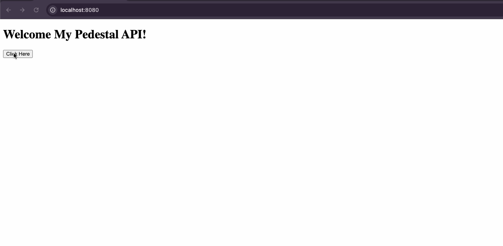

# My Pedestal App

## Description

This is a simple application that demonstrates how to create a functional REST API using the **Pedestal** framework in Clojure. The application serves a basic HTML page with a button. When the button is clicked, it sends a request to the server, which responds with a simple message.



## Prerequisites

- **Java JDK** 11 or higher
- **Leiningen** 2.9.1 or higher

## Installation

1. **Clone the repository:**

   ```bash
   git clone https://github.com/elton-peixoto-lu/my-pedestal-app.git